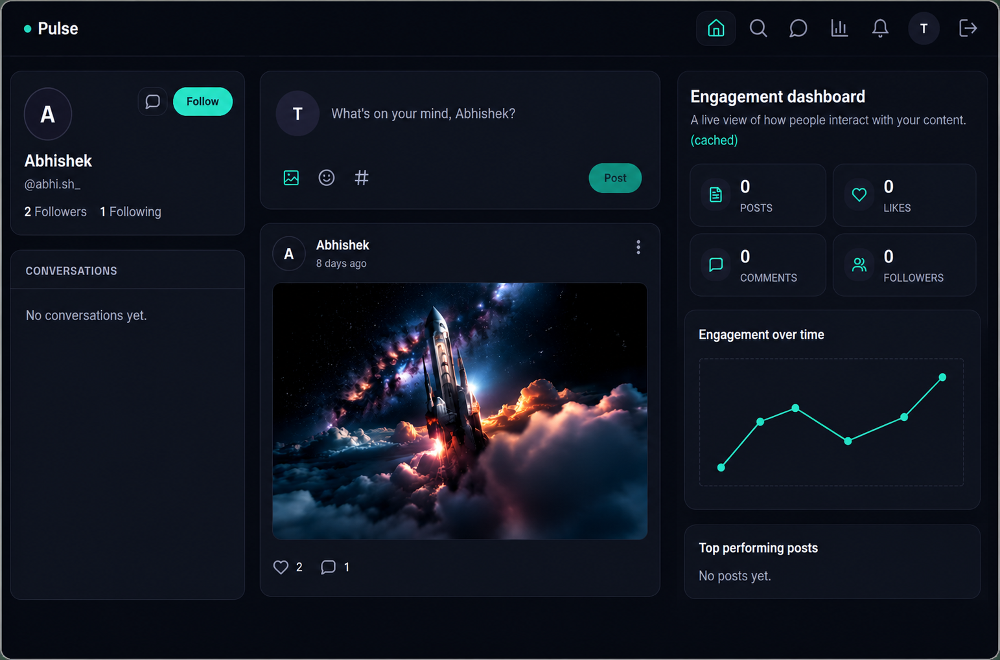
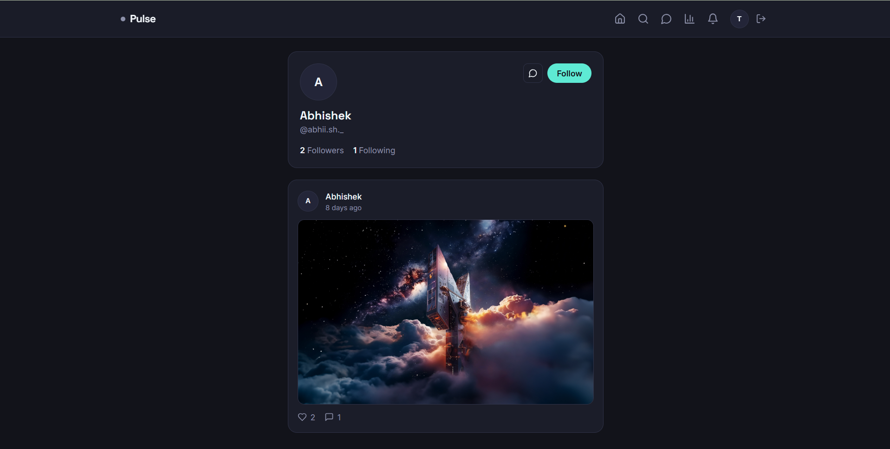
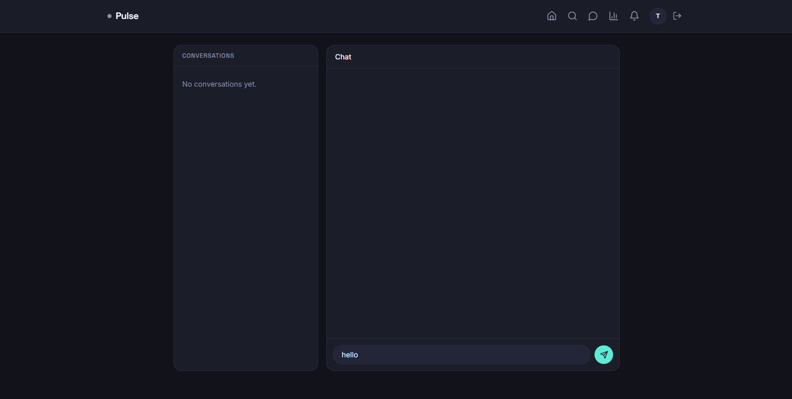
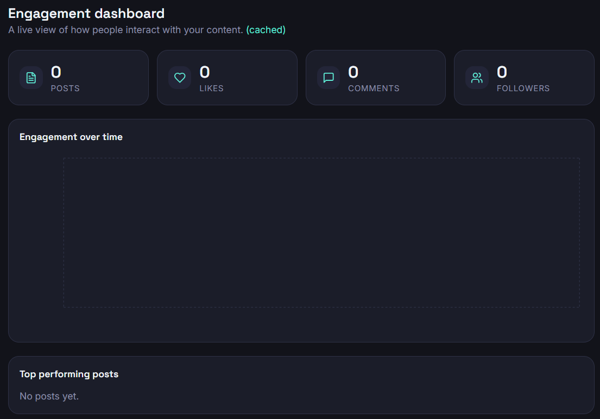

# 🚀 Pulse

<p align="center">
  
</p>

<p align="center">


</p>

<p align="center">

A modern full-stack social networking platform built with the MERN stack, featuring real-time messaging, Redis-powered notifications, secure authentication, user engagement analytics, and a responsive user experience.

</p>

---

# 🌐 Live Demo

> 🚧 Coming Soon

---

# ✨ Features

- 🔐 JWT Authentication
- 💬 Real-time Messaging (Socket.IO)
- 🔔 Redis Pub/Sub Notifications
- ❤️ Like & Comment System
- 👥 Follow / Unfollow Users
- 📝 Create, Edit & Delete Posts
- 🖼️ Media Uploads
- 📊 Engagement Analytics Dashboard
- 👤 User Profiles
- 📱 Fully Responsive Design

---

# 📸 Screenshots

## 🏠 Home Feed



---

## 💬 Real-Time Messaging



---

## 📊 Analytics Dashboard




---

# 🛠 Tech Stack

## Frontend

- React (Vite)
- Tailwind CSS
- Axios
- React Context API
- Recharts
- Socket.IO Client

## Backend

- Node.js
- Express.js
- MongoDB
- Mongoose
- Socket.IO
- Redis (ioredis)

## Authentication

- JWT
- bcrypt

## Media Uploads

- Multer

---

# 🏗 Architecture

```
Client (React)

↓

Express API

↓

MongoDB

↓

Redis Pub/Sub

↓

Socket.IO

↓

Real-time Client Updates
```

---

# 🔔 Notification Flow

1. User performs an action (Like, Comment, Follow)
2. Express API stores notification
3. Notification published to Redis
4. Socket.IO server receives Redis event
5. Event pushed instantly to recipient
6. React updates notification bell without polling

---

# 📁 Project Structure

```
pulse-social-platform/

├── client/
│   ├── src/
│   ├── components/
│   ├── context/
│   ├── pages/
│   └── api/

├── server/
│   ├── config/
│   ├── middleware/
│   ├── models/
│   ├── routes/
│   ├── services/
│   ├── sockets/
│   └── server.js

└── docker-compose.yml
```

---

# ⚙️ Getting Started

## Clone Repository

```bash
git clone https://github.com/techabhiii03/pulse-social-platform.git
```

## Backend

```bash
cd server
npm install
npm run dev
```

## Frontend

```bash
cd client
npm install
npm run dev
```

---

# 📡 API Highlights

| Method | Endpoint | Description |
|---------|----------|-------------|
| POST | `/api/auth/login` | Login |
| POST | `/api/auth/register` | Register |
| GET | `/api/posts/feed` | User Feed |
| POST | `/api/posts` | Create Post |
| POST | `/api/posts/:id/comments` | Add Comment |
| GET | `/api/messages/:userId` | Chat |
| GET | `/api/notifications` | Notifications |
| GET | `/api/analytics/summary` | Dashboard |

---

# 🚀 Future Improvements

- Cloudinary Image Storage
- Infinite Feed Scrolling
- Video Uploads
- Story Feature
- Push Notifications
- OAuth Login
- Docker Deployment
- CI/CD Pipeline

---

# 💡 What I Learned

Building Pulse helped me gain practical experience in:

- Designing REST APIs
- Authentication using JWT
- Redis Pub/Sub Architecture
- Real-time communication with Socket.IO
- MongoDB Schema Design
- Responsive Frontend Development
- State Management
- Backend Project Structure

---

# 👨‍💻 Author

**Abhishek Sharma**

Full Stack Developer

📧 Mail: abhiiishek.work@gmail.com

💼 LinkedIn: https://www.linkedin.com/in/abhiishek-sharma-96ba38378/

🌐 Portfolio (Coming Soon)

⭐ If you like this project, consider giving it a star!